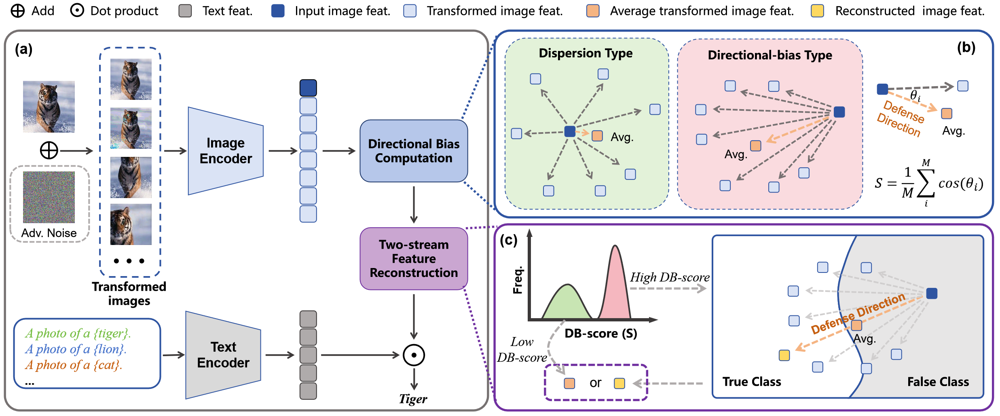

# **[ICLR 2026] Adversarial Attacks Already Tell the Answer: Directional Bias-Guided Test-time Defense for Vision-Language Models**

## Framework



## Installation

```bash
conda create -n dbd python=3.8
conda activate dbd

pip install torch==1.12.1+cu116 torchvision==0.13.1+cu116 torchaudio==0.12.1 --extra-index-url https://download.pytorch.org/whl/cu116

pip install packaging tqdm ftfy regex opencv-python scipy
```

## Dataset

Please follow the [DATASETS](https://github.com/KaiyangZhou/CoOp/blob/main/DATASETS.md) instructions in [CoOp](https://github.com/KaiyangZhou/CoOp) to download the required datasets. By default, place them under `./test_data` with the following structure:

```
test_data
├── caltech-101
├── dtd
├── eurosat
├── fgvc_aircraft
├── food-101
├── imagenet
├── imagenet-adversarial
├── imagenet-rendition
├── imagenet-sketch
├── imagenetv2
├── oxford_flowers
├── oxford_pets
├── stanford_cars
├── sun397
└── ucf101
```

## Generate Adversarial Images

You can pre-generate adversarial images by running:

```bash
python generate_adv_images.py --test_sets DTD --data_root ./test_data -n 16 -b 256 --arch ViT-B/32 --eps 4.0 --alpha 1.0 --steps 100 --attack pgd
```

## Test-time Defense

**Evaluate accuracy on clean images:**

```bash
python infer_dbd.py --test_sets DTD --adv_dir clean --data_root ./test_data --arch ViT-B/32 -n 8 --seed 0
```

**Evaluate robust accuracy on adversarial images:**

```bash
python infer_dbd.py --test_sets DTD --adv_dir adv_images/ViT-B-32_pgd_eps4.0 --arch ViT-B/32 -n 8 --seed 0
```

## Acknowledgement

This project builds upon or references the following open-source works: [R-TPT](https://github.com/TomSheng21/R-TPT), [adversarial-attacks-pytorch](https://github.com/Harry24k/adversarial-attacks-pytorch), [CoOp](https://github.com/KaiyangZhou/CoOp), and [CLIP](https://github.com/openai/CLIP). We thank the authors for their contributions.

## Citation

If you find this project useful in your research, please consider citing:

```bibtex
@inproceedings{liu2026adversarial,
  title={Adversarial Attacks Already Tell the Answer: Directional Bias-Guided Test-time Defense for Vision-Language Models},
  author={Liu, Liangsheng and Chen, Si and Wu, Jiamin and Feng, Weiwei and Cheng, Zhixin and Yin, Xiaotian and Yang, Wenfei and Zhang, Tianzhu},
  booktitle={The Fourteenth International Conference on Learning Representations},
  year={2026}
}
```
